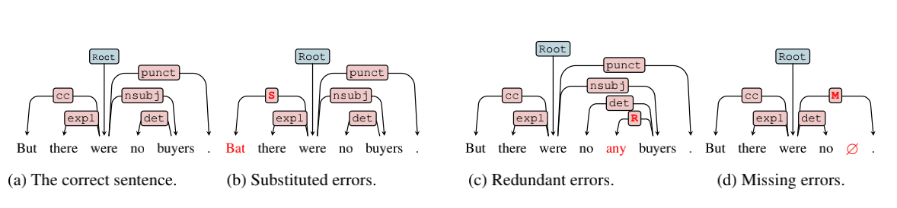

# SynGEC
Official implementation for the EMNLP-2022 paper "SynGEC: Syntax-Enhanced Grammatical Error Correction with a Tailored GEC-Oriented Parser". [[Paper Link]](https://arxiv.org/pdf/2210.12484)

# Citation

If you think our work is helpful, please cite the following paper:

```
@inproceedings{zhang2022syngec,
  author = {Zhang, Yue and Zhang, Bo and Li, Zhenghua and Bao, Zuyi and Li, Chen and Zhang, Min},
  title = {SynGEC: Syntax-Enhanced Grammatical Error Correction with a Tailored GEC-Oriented Parser},
  booktitle = {Proceedings of EMNLP},
  year = {2022}
}
```

# Overview
We propose an approach named **SynGEC** to incorporate adapted dependency syntax knowledge into GEC models. The key idea is adjusting vanilla
dependency parsers to accommodate ungrammatical sentences. To achieve this goal, we first extend the standard syntax representation scheme to use
a unified tree structure to encode both grammatical errors and syntactic structure. Then we obtain high-quality parse trees of ungrammatical sentences by projecting target-side trees into source-side ones in parallel GEC training data, which are ultimately used for training a tailored parser named **GOPar**.



To encode parse trees produced by GOPar, we present a DepGCN-based GEC model built on Transformer. Experiments on mainstream datasets in two languages (English & Chinese) show that SynGEC is effective and achieves competitive results.

# How to Install

You can use the following commands to install the environment for SynGEC:

```
conda create -n syngec python==3.8
conda activate syngec
pip install -r requirements.txt
python -m spacy download en
cd src/src_syngec/fairseq-0.10.2
pip install --editable ./
```

The SynGEC model for GEC is based on [fairseq-0.10.2](https://github.com/facebookresearch/fairseq/tree/v0.10.2).

The GOPar model for parsing ungrammatical inputs is based on [SuPar](https://github.com/yzhangcs/parser).

Please turn to their repos for more instructions ~


# How to Use

## Description of Codes
```
|-- bash  # Some scripts to reproduce our results
|   |-- chinese_exp
|   `-- english_exp
|-- data  # Data files (mainly parallel sentence files)
|   |-- bea19_dev
|   |-- bea19_test
|   |-- clang8_train
|   |-- conll14_test
|   |-- dicts
|   |-- error_coded_train
|   |-- hsk+lang8_train
|   |-- hsk_train
|   |-- mucgec_dev
|   |-- mucgec_test
|   `-- wi_locness_train
|-- model  # Model checkpoints for GOPar and SynGEC
|   |-- gopar
|   `-- syngec
|-- pics  # Pictures
|-- preprocess  # Preprocessed binary files for fairseq training
|-- pretrained_weights  # Pretrained language models, e.g., BART
|-- src  # Main codes of our GOPar and SynGEC models
|   |-- src_gopar
|   `-- src_syngec
|       |-- fairseq-0.10.2  # Our modified Fairseq. Specifically, we modify their trainer, modules, datasets, etc.
|       `-- syngec_model  # Main model files for SynGEC
`-- utils  # Some important tools, including tree projection codes
```

## SynGEC
**Note: All checkpoints/raw data/preprocessed files have not been uploaded, so the links are empty now. We will upload them as soon as possible.**
You can download the following converged checkpoints and change the model path in bash files like `./bash/*_exp/generate_*` to generate GEC results.

English Models:

| Name | Download Link | Description |
| :------- | :---------: | :---------: |
| **Transformer-en** | [Link](1) | Transformer-based GEC Model |
| **SynGEC-en** | [Link](1) | SynGEC Model based on Transformer|
| **BART-en** | [Link](1) | BART-based GEC Model|
| **SynGEC-BART-en** | [Link](1) | SynGEC Model Enhanced with BART |

Chinese Models:
| Name | Download Link | Description |
| :------- | :---------: | :---------: |
| **Transformer-zh** | [Link](1) | Transformer-based GEC Model |
| **SynGEC-zh** | [Link](1) | SynGEC Model based on Transformer|
| **BART-zh** | [Link](1) | BART-based GEC Model|
| **SynGEC-BART-zh** | [Link](1) | SynGEC Model Enhanced with BART |

For example, you can download the `Transformer-en` model and put it at `./model/syngec/english_transformer_baseline.pt`. Then you can run the following script to generate results for CoNLL-14 dataset:
```
OUTPUT_DIR=./results
FAIRSEQ_DIR=./src_syngec/fairseq-0.10.2/fairseq_cli
MODEL_PATH=./model/syngec/english_transformer_baseline.pt
echo "Generating CoNLL14..."
SECONDS=0

CUDA_VISIBLE_DEVICES=$CUDA_DEVICE python -u ${FAIRSEQ_DIR}/interactive.py $PROCESSED_DIR/bin \
    --user-dir ./src/src_syngec/syngec_model \
    --task syntax-enhanced-translation \
    --path ${MODEL_PATH} \
    --beam ${BEAM} \
    --nbest ${N_BEST} \
    -s src \
    -t tgt \
    --buffer-size 5000 \
    --batch-size 32 \
    --num-workers 12 \
    --log-format tqdm \
    --remove-bpe \
    --fp16 \
    < $OUTPUT_DIR/CoNLL14.src.bpe

echo "Generating Finish!"
duration=$SECONDS
echo "$(($duration / 60)) minutes and $(($duration % 60)) seconds elapsed."

cat $OUTPUT_DIR/CoNLL14.out.nbest | grep "^D-"  | python -c "import sys; x = sys.stdin.readlines(); x = ''.join([ x[i] for i in range(len(x)) if (i % ${N_BEST} == 0) ]); print(x)" | cut -f 3 > $OUTPUT_DIR/CoNLL14.out
sed -i '$d' $OUTPUT_DIR/CoNLL14.out
python ./utils/post_process_english.py $OUTPUT_DIR/CoNLL14.src $OUTPUT_DIR/CoNLL14.out $OUTPUT_DIR/CoNLL14.out.post_processed
```

For SynGEC models, you need to first preprocess the syntactic information of test-sets as described in `./bash/*_exp/preprocess_*.sh`, and then generate results like this:
```
OUTPUT_DIR=./results
FAIRSEQ_DIR=./src_syngec/fairseq-0.10.2/fairseq_cli
MODEL_PATH=./model/syngec/english_transformer_syngec.pt
echo "Generating CoNLL14..."
SECONDS=0

CUDA_VISIBLE_DEVICES=$CUDA_DEVICE python -u ${FAIRSEQ_DIR}/interactive.py $PROCESSED_DIR/bin \
    --user-dir ./src/src_syngec/syngec_model \
    --task syntax-enhanced-translation \
    --path ${MODEL_DIR}/checkpoint_best.pt \
    --beam ${BEAM} \
    --nbest ${N_BEST} \
    -s src \
    -t tgt \
    --buffer-size 5000 \
    --batch-size 32 \
    --num-workers 12 \
    --log-format tqdm \
    --remove-bpe \
    --fp16 \
    --conll_file $CoNLL14_TEST_BIN_DIR/test.conll.src-tgt.src\
    --dpd_file $CoNLL14_TEST_BIN_DIR/test.dpd.src-tgt.src \
    --probs_file $CoNLL14_TEST_BIN_DIR/test.probs.src-tgt.src \
    --output_file $OUTPUT_DIR/CoNLL14.out.nbest \
    < $OUTPUT_DIR/CoNLL14.src.bpe

echo "Generating Finish!"
duration=$SECONDS
echo "$(($duration / 60)) minutes and $(($duration % 60)) seconds elapsed."
```

## GOPar
We also provide our fine-tuned GEC-oriented parser (GOPar), which can jointly parse the trees of ungrammatical sentences and identitfy underlying grammatical errors.

| Name | Download Link | Description |
| :------- | :---------: | :---------: |
| **biaffine-dep-electra-en-gopar** | [Link](1) | GOPar for English |
| **biaffine-dep-electra-zh-gopar** | [Link](1) | GOPar for Chinese |

You can use `./src_gopar/parse.py` to parse with downloaded GOPar checkpoints.

# How to Train
If you want to train new models using your own dataset, please follow the instructions in `./bash/*_exp`:

+ `pipeline_gopar.sh`: train GOPar;

+ `preprocess_syngec_*.sh`: preprocess data for training GEC models;

+ `train_syngec_*.sh`: train baseline & SynGEC models;

+ `generate_syngec_*.sh`: generate results (CoNLL14 and BEA19 for English, NLPCC18 and MuCGEC for Chinese);

You can also download the preprocessed data files from this [Link](1). **Note that you must get their licenses first!** 

## Use Your Own Data
Each data folder should contain the following files:

+ src.txt
+ tgt.txt (except test-sets)

Each line of these files should contain a sample (a line of source/target sentence).


# Contact
If you have any questions, feel free to drop me an issue or contact me at [hillzhang1999@qq.com](mailto:hillzhang1999@qq.com).
